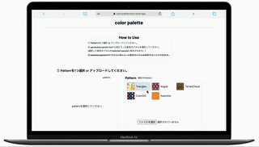
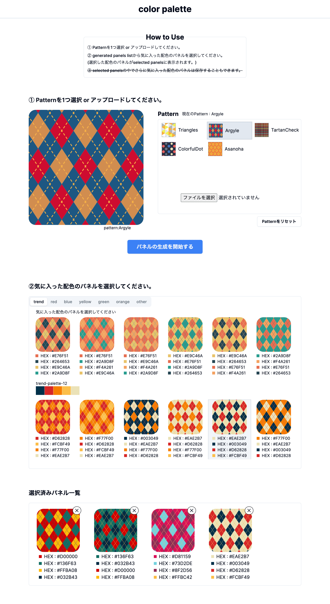

## <u>color-palette</u>

##### <概要>

illustratorで柄模様を作ることにハマっていたときに作成したサイトです。
柄模様のSVGデータをアップロードすると、異なる配色の柄模様をランダムで生成してくれます。
また生成された柄模様のHexコードをコピーできる仕様になっています。

##### <製作日>

2024年1月（制作期間：約1ヶ月）

##### <仕様>

サイトは主に以下の3コンポーネントで構成されています。

__SelectAndUploadPatternコンポーネント__
>SVGデータをアップロードするコンポーネントです。
ここでアップロードされたSVGコード等がRecoil経由でGeneratedPanelListに渡されます。

__GeneratedPanelListコンポーネント__
>アップロードされたSVGコード内のHexコード等をランダムに書き換えて異なる配色の柄模様を生成します。
生成された柄模様の中で気に入った柄模様は選択され、Recoil経由でSelectedPanelListに渡されます。

__SelectedPanelListコンポーネント__
>GeneratedPanelListで選択された柄模様が表示されます。
表示された柄模様のHexコードをコピーできます。

##### <使用技術>

Next.js13(app router), recoil, tailwind, shadcn, typescript, etc

##### <参考URL>

<warning:Cannot update a component while rendering~>

- [Cannot update a component while rendering ~.というwarningの原因と対処方法について](https://zenn.dev/kingdom0927/articles/bfccfcf272dee9)

<inputのファイルアップロード機能実装>

- [FileReader.readAsText()](https://developer.mozilla.org/ja/docs/Web/API/FileReader/readAsText)
- [【JavaScript】addEventListenerの使い方](https://qiita.com/mzmz__02/items/873118fbd8723c44956d)
- [addEventListener と"onなんたら"の違い](http://tech.hikware.com/article/20180204a.html)

<Property 'checked' does not exist on type 'Element'.>

- [TypeScript で querySelector メソッドを使うときに型引数を指定する](https://developer.hatenastaff.com/entry/2020/12/12/121212)

<アップロードされたSVGコードから重複のないHEXコード配列を抽出する>

- [JavaScript Setオブジェクト](https://qiita.com/chihiro/items/0e610a31b589e3cc435f)
- [new Set使用時にTypeScriptに怒られない方法](https://tukkytech.com/blog/ts-set-check/)

<HTMLテキストをコピー>

- [【JS】文章をコピーするボタンをつくる](https://zenn.dev/itayuri/articles/bc1209112d4340)

<ツールチップの表示>

- [【CSS】ツールチップをHTMLとCSSだけで簡単に作る](https://www.jungleocean.com/programming/190308tooltip-css)
- [【CSS】displayにtransitionが効かない時の対処法](https://webcreatetips.com/coding/3414/#displaytransiton-2)
- [【React/TypeScript】onClickなどのイベント処理で要素ごとに引数を渡したい場合](https://qiita.com/tobita0000/items/9cfa933324a3f6fe504d)
- [JavaScriptでカスタムデータ属性の値を取得・変更する](https://sarchitect.net/10929/)
- [CSSの擬似要素::beforeや::afterのcontentプロパティを動的に変更する方法](https://www.tam-tam.co.jp/tipsnote/html_css/post9753.html)

<その他>

- [【Javascript】オブジェクトのキーに変数を指定する方法](https://white-space.work/assign-variables-to-key-of-object-in-javascript/)
- [[TypeScript] ブラケット記法を使用した際のインデックスシグネチャエラーにハマった](https://zenn.dev/buzzkuri_tech/articles/3807d042d310a7)
- [Next.js と TypeScript で、コールシグネチャを理解する](https://commte.net/nextjs-call-signature)
- [オブジェクトにType Annotation（型注釈）をつける方法](https://www.mitomex.blog/typescript-annotation-object/)
- [React Componentでmapのネストでつまづいたのでメモ](https://zenn.dev/takayuri/articles/d57f5708afcaaa)
- [TypeScript の「オーバーロード」について](https://numb86-tech.hatenablog.com/entry/2020/06/25/122458)